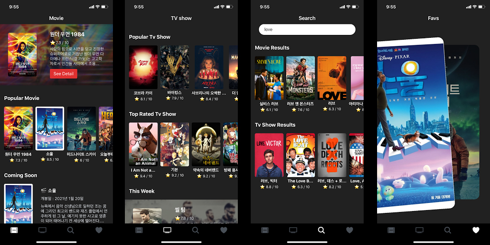

# FizzyPop

최신,인기 영화,tv쇼 소개 앱

## Stack

- Expo
- ReactNavigation
- Axios
- TMDB API
- styled-components
- prop-types

## Function implementation

- [x] reactNavigation으로 page routing (Stack Navigator,Tabs Navigator)
- [x] Navigation screen의 navigation/route prop로 tabMenu 변경 시 headerTitle 변경되게 함.
- [x] axios로 TMDB API 요청
- [x] page에 필요한 data가 render 한번에 모두 get할 수 있게 useState구현
- [x] react-native-web-swiper로 slider 구현
- [x] 컨텐츠 서치기능 구현
- [x] 컨텐츠 클릭(터치)시 해당 컨텐츠 상세소개로 넘어감.
- [x] 웹브라우저 접속: 홈페이지에 업로드 된 video links, youtube links 구현
- [x] CardMotion: PanResponder(reactNative API)로 사용자 제스처 인식해 애니메이션 구현

## ScreenShot

